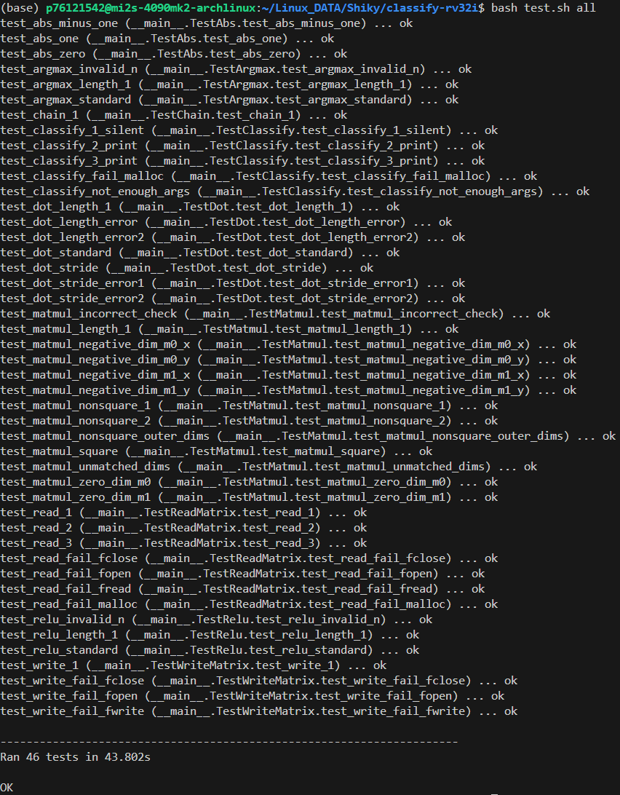

# Assignment 2: Classify
## All Pass Screenshot


## abs.s

### Description

`abs.s` is a function designed to convert an integer to its absolute value. The function modifies the original value through pointer dereferencing.

### Usage

- **Input Parameter**:
  - `a0` (int *): A pointer to the memory address of the integer to be converted.
- **Return Value**:
  - None. The operation directly modifies the value at the pointer's address.

### Detailed Steps

1. Load the integer from the memory address pointed by `a0` into `t0`.
2. If the integer is non-negative, branch to `done`.
3. If the integer is negative, negate it by subtracting it from zero and store the result back to the memory address pointed by `a0`.
4. Return from the function.

### Examples

- Input `-5`, output `5`.
- Input `3`, output `3`.

### Related Code

```assembly
abs:
    lw t0 0(a0)
    bge t0, zero, done
    sub t0, zero, t0
    sw t0 0(a0)
done:
    jr ra
```

## relu.s

### Usage

- **Input Parameter**:
  - `a0`: Pointer to integer array to be modified
  - `a1`: Number of elements in array

- **Return Value**:
  - None - Original array is modified directly

### Detailed Steps

1. Initialize a counter `t1` to 0.
2. Use a loop to iterate through each element of the array:
   - Load the current element into `t2`.
   - If the element is greater than 0, continue to the next element.
   - If the element is 0 or negative, set it to 0.
3. Return from the function.

### Examples

- Input `[-2, 0, 3, -1, 5]`, output `[0, 0, 3, 0, 5]`.

### Related Code

```assembly
relu:
    li t0, 1
    blt a1, t0, error
    li t1, 0
    addi t4, a0, 0
loop_start:
    lw t2, 0(t4)
    bgt t2,x0 ReLUEnd
    addi t2, x0, 0
    sw t2, 0(t4)
ReLUEnd:
    addi t1, t1, 1
    addi t4, t4, 4
    blt t1, a1, loop_start
    jr ra
error:
    li a0, 36
    j exit
```

## argmax.s

### Description

`argmax.s` is a function that scans an integer array to find its maximum value and returns the position of its first occurrence. If multiple elements share the maximum value, it returns the smallest index.

### Usage

- **Input Parameters**:
  - `a0` (int *): Pointer to the first element of the array.
  - `a1` (int): Number of elements in the array.
- **Return Value**:
  - `a0` (int): Position of the first maximum element (0-based index).

### Detailed Steps

1. Initialize the maximum value with the first element of the array.
2. Iterate through the array:
   - Compare each element with the current maximum.
   - Update the maximum and its index if a larger element is found.
3. Return the index of the first maximum element.

### Examples

- Input `[1, 3, 2, 3]`, output `1`.
- Input `[5, 5, 5]`, output `0`.

### Related Code

```assembly
argmax:
    li t6, 1
    blt a1, t6, handle_error
    lw t0, 0(a0)
    addi t1, a0, 4
    li t2, 1
    li t4, 0
loop_start:
    beq a1, t2, loop_end
    lw t3, 0(t1)
    ble t3, t0, no_update_max
    addi t0, t3, 0
    addi t4, t2, 0
no_update_max:
    addi t2, t2, 1
    addi t1, t1, 4
    j loop_start
loop_end:
    mv a0, t4
    jr ra
handle_error:
    li a0, 36
    j exit
```

## dot.s

### Description

`dot.s` is a function that calculates the dot product of two integer arrays with specified strides.

### Usage

- **Input Parameters**:
  - `a0` (int *): Pointer to the first input array.
  - `a1` (int *): Pointer to the second input array.
  - `a2` (int): Number of elements to process.
  - `a3` (int): Skip distance in the first array.
  - `a4` (int): Skip distance in the second array.
- **Return Value**:
  - `a0` (int): Resulting dot product value.

### Detailed Steps

1. Initialize a sum accumulator `s0` to zero and a counter `s1` to zero.
2. use `slli` to calculate the strides.
3. Iterate through the arrays
    - Load the current element of both arrays into `a0` and `a1`.
    - Call `my_mul` to multiply the two elements.
    - Add the result to `s0`.
    - Increment the pointers by strides.
4. Return the sum.

### Examples

- Input arrays `[1, 2, 3]` and `[4, 5, 6]` with strides `1`, output `32`.

### Related Code

```assembly
dot:
    li t0, 1
    blt a2, t0, error_terminate
    blt a3, t0, error_terminate
    blt a4, t0, error_terminate
    addi sp, sp, -32
    sw ra, 0(sp)
    sw s0, 4(sp)
    sw s1, 8(sp)
    sw s2, 12(sp)
    sw s3, 16(sp)
    sw s4, 20(sp)
    sw s5, 24(sp)
    sw s6, 28(sp)
    li s0, 0
    li s1, 0
    addi s2, a0, 0
    addi s3, a1, 0
    addi s4, a2, 0
    slli s5, a3, 2
    slli s6, a4, 2
loop_start:
    bge s1, s4, loop_end
    lw a0, 0(s2)
    lw a1, 0(s3)
    jal my_mul
    add s0, s0, a0
    add s2, s2, s5
    add s3, s3, s6
    addi s1, s1, 1
    j loop_start
loop_end:
    mv a0, s0
    lw ra, 0(sp)
    lw s0, 4(sp)
    lw s1, 8(sp)
    lw s2, 12(sp)
    lw s3, 16(sp)
    lw s4, 20(sp)
    lw s5, 24(sp)
    lw s6, 28(sp)
    addi sp, sp, 32

    jr ra
```

## matmul.s

### Description

`matmul.s` is a function that performs matrix multiplication on two matrices, resulting in a new matrix.

### Usage

- **Input Parameters**:
  - `a0` (int *): Pointer to the first matrix (M0).
  - `a1` (int): Number of rows in the first matrix.
  - `a2` (int): Number of columns in the first matrix.
  - `a3` (int *): Pointer to the second matrix (M1).
  - `a4` (int): Number of rows in the second matrix.
  - `a5` (int): Number of columns in the second matrix.
  - `a6` (int *): Pointer to the result matrix (D).
- **Return Value**:
  - None. The result matrix is populated in-place.

### Detailed Steps
1. Perform parameter validation and initialize `s0` and `s1` as counters for the outer and inner loops, respectively.
2. In the outer loop, move the starting row of `M0` for each iteration.
3. In the inner loop, use different columns of `M1` to compute the dot product with the same row from the outer loop, producing all results for one row of `D`.
4. Store the computed values in `s2`, which corresponds to the respective location in `D`.


### Examples

- Multiply a 2x3 matrix with a 3x2 matrix to get a 2x2 result matrix.
- Perform a dot product between row 1 of `M0` and column 1 of `M1` to obtain the value for row 1, column 1 of `D`.

### Related Code

```assembly
matmul:
    # Error checks
    li t0 1
    blt a1, t0, error
    blt a2, t0, error
    blt a4, t0, error
    blt a5, t0, error
    bne a2, a4, error

    # Prologue
    addi sp, sp, -32
    sw ra, 0(sp)
    sw s0, 4(sp)
    sw s1, 8(sp)
    sw s2, 12(sp)
    sw s3, 16(sp)
    sw s4, 20(sp)
    sw s5, 24(sp)
    sw s6, 28(sp)

    li s0, 0 # outer loop counter
    li s1, 0 # inner loop counter
    mv s2, a6 # incrementing result matrix pointer
    mv s3, a0 # incrementing matrix A pointer, increments during outer loop
    mv s4, a3 # incrementing matrix B pointer, increments during inner loop

outer_loop_start:
    #s0 is going to be the loop counter for the rows in A
    li s1, 0
    mv s4, a3
    blt s0, a1, inner_loop_start
    j outer_loop_end

inner_loop_start:
    beq s1, a5, inner_loop_end
    addi sp, sp, -24
    sw a0, 0(sp)
    sw a1, 4(sp)
    sw a2, 8(sp)
    sw a3, 12(sp)
    sw a4, 16(sp)
    sw a5, 20(sp)

    mv a0, s3 # setting pointer for matrix A into the correct argument value
    mv a1, s4 # setting pointer for Matrix B into the correct argument value
    li a3, 1 # stride for matrix A
    mv a4, a5 # stride for matrix B
    jal dot
    mv s6, a0 # storing result of the dot product into s6

    lw a0, 0(sp)
    lw a1, 4(sp)
    lw a2, 8(sp)
    lw a3, 12(sp)
    lw a4, 16(sp)
    lw a5, 20(sp)
    addi sp, sp, 24

    sw s6, 0(s2)
    addi s2, s2, 4 # Incrememtning pointer for result matrix
    li t1, 4
    add s4, s4, t1 # incrememtning the column on Matrix B
    addi s1, s1, 1
    j inner_loop_start

inner_loop_end:
    slli s6, a2, 2
    add s3, s3, s6
    addi s0, s0, 1
    j outer_loop_start

outer_loop_end:
    # Epilogue
    lw ra, 0(sp)
    lw s0, 4(sp)
    lw s1, 8(sp)
    lw s2, 12(sp)
    lw s3, 16(sp)
    lw s4, 20(sp)
    lw s5, 24(sp)
    lw s6, 28(sp)
    addi sp, sp, 32
    jr ra

error:
    li a0, 38
    j exit
```
